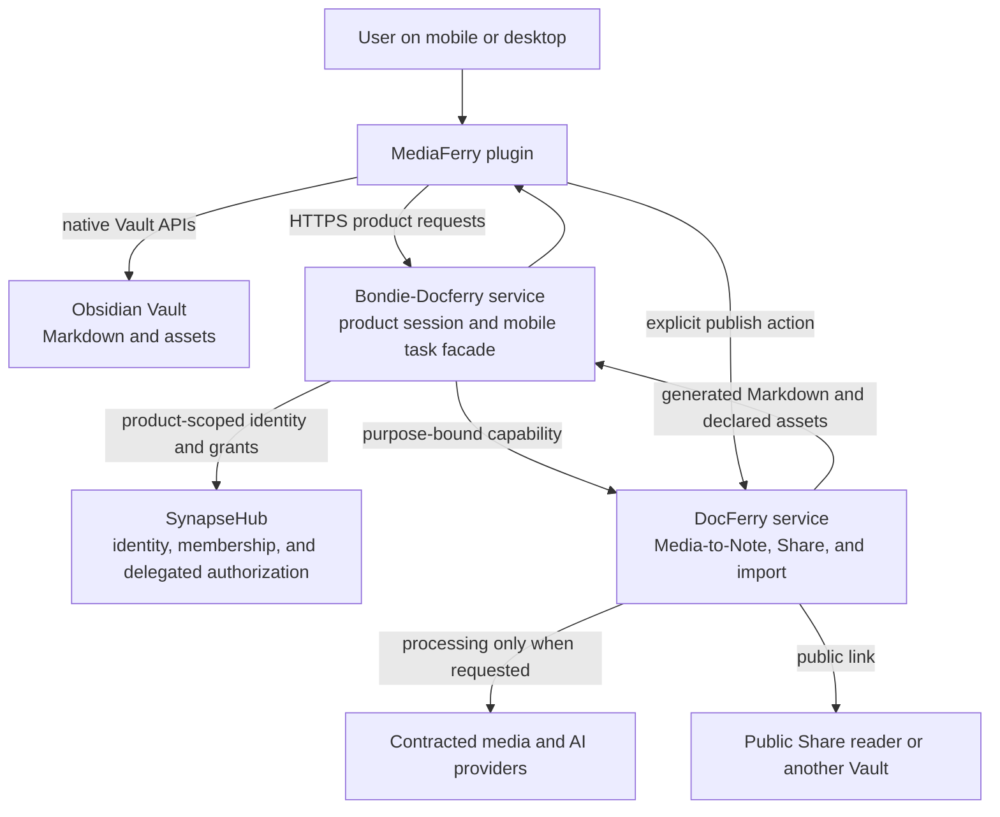
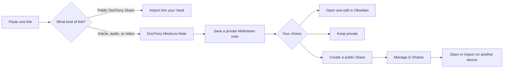

# MediaFerry — Engineering

> An Obsidian plugin client for a hosted media-to-note pipeline: one link field in,
  private Markdown notes out, optional public Shares with a full lifecycle.

**English** · [中文](ENGINEERING.zh-CN.md) — [‹ User README](README.md)

MediaFerry (id `mediaferry`) is a mobile-first Obsidian plugin (TypeScript, esbuild, no framework)
that fronts the hosted Bondie / SynapseHub / DocFerry services. The client owns link
intake, the mobile UI, local settings, native Vault writes, and the explicit sharing
choice. Everything that needs credentials or heavy processing stays server-side.

> **Naming.** The plugin is named **MediaFerry** (id `mediaferry`). Its release
> candidates shipped under the earlier name *Bondie-Docferry*. Internal identifiers
> intentionally keep the legacy `bondie-docferry` prefix because they are server or
> storage contracts: the `obsidian://bondie-docferry-auth` protocol handler (the hosted
> login redirect target), the SecretStorage keys in `src/auth/session.ts` (renaming
> would orphan existing sessions), `PRODUCTION_SERVER_URL`, the `bondie-docferry.pro`
> entitlement key, and the internal view-type/CSS identifiers. The *Bondie-Docferry
> service* in the diagram below is a hosted backend component and keeps its name.

## Architecture

The system flow, end to end:



And the product flow as the user experiences it:



### Ownership and trust boundaries

| Component | Owns | Does not own |
| --- | --- | --- |
| **Obsidian plugin** | Link intake, mobile UI, local settings, native Vault writes, explicit sharing choice | Provider credentials, billing data, remote Share truth |
| **Bondie-Docferry service** | Product session, mobile task facade, recovery state, capability requests | DocFerry user session, Stripe card data, Vault contents |
| **SynapseHub** | Shared identity, account lifecycle, membership projection, product authorization | User notes, generated Markdown, local Vault paths |
| **DocFerry** | Media-to-Note processing, shared quota, public Shares, import payloads | Bondie product session, local Vault access |
| **Obsidian Vault** | User-owned Markdown and imported assets | Hosted processing or public links |

Security properties: the Bondie-Docferry service and DocFerry keep separate product sessions with no
shared cookies; cross-product calls use short-lived, purpose-bound capabilities; AI and
media provider credentials never leave the hosted DocFerry runtime; the plugin receives
no Auth0 management secret, SynapseHub management token, Stripe secret, provider key, or
DocFerry user token. See also [docs/architecture.md](docs/architecture.md) and
[PRIVACY.md](PRIVACY.md).

## How the features work

### Link intake and intent classification

`classifyLinkIntent` (`src/docferry/importContract.ts`) runs on every keystroke over the
single Home field, with no network involved:

- **Empty / invalid** — non-http(s) or unparseable URLs disable the Continue button.
- **`docferry-share`** — matches exactly `https://docferry.bondie.io/s/{slug}` where the
  slug is `[A-Za-z0-9_-]{1,64}` (no query, hash, or credentials). The button becomes
  **Import** and no session is required.
- **`web`** — any other http(s) URL is sent to `POST /v0/parse/jobs` as
  `{ language, source_url, template }` (template fixed to `default-video-brief`). Web
  links require a session; the button becomes **Create note**, or **Sign in** when
  signed out.

There is no client-side domain allowlist; unsupported sources are rejected server-side
and mapped by `src/parse/errorPolicy.ts` to *"This link is not supported yet…"*.

### Media-to-Note job lifecycle

`src/parse/parseJob.ts` drives the remote job through the stages
`received → metadata → transcript → structure → template → complete | failed | cancelled`
(a 0–100 `progress` value is rendered as friendly status labels). Polling starts at
500 ms intervals (first 10 attempts) then relaxes to 1500 ms, bounded by a 3-minute
deadline. Job creation sends an `Idempotency-Key` so retries cannot double-submit.

Transport errors are tolerated up to 3 times with exponential backoff
(`src/parse/retryPolicy.ts`, status *"Connection interrupted. Reconnecting."*). Past
that, the job is classified as an **interruption** rather than a failure: the pending
record is kept and the UI says *"Reopen MediaFerry to continue your note."* The
same applies when the 3-minute deadline expires while the server is still working.

### Mobile resilience: `pendingParse`

Before any parse starts, a `pendingParse` record (`createdAt`, `jobId`, `language`,
`requestKey`, `sourceUrl`, `template`) is persisted into plugin settings, so the job
survives app backgrounding or process death. On view open — and on the
`visibilitychange` handler registered in `src/main.ts` — the view calls
`resumeFromForeground()` / `resumePendingParse()` to resume polling with the existing
session. Records older than **24 hours** are discarded by `normalizePendingParse`
(`src/settings.ts`). Cancel hits the remote cancel endpoint; Retry (offered on
failed/cancelled jobs in *Account → Processing data*) re-creates a pendingParse;
Delete clears both the remote data and the matching pending record. Signing out or
switching accounts always clears the pending record.

### Vault writes

- **Generated notes** (`src/vault/saveNote.ts`) land in the "Generated notes folder"
  (default `Bondie Docferry`) as `{YYYY-MM-DD} {title}.md`, with `-2`…`-999` suffixes on
  name collisions and illegal filename characters replaced. The server-provided Markdown
  is written **verbatim** — the client adds no frontmatter; the only transformation is
  `removeMatchingLeadingTitle` (`src/vault/noteContent.ts`), which strips a leading
  `# Title` matching the note title so Obsidian's inline title is not duplicated.
- **Imported shares** (`src/vault/importDocferryShare.ts`) land in the "Imported notes
  folder" (default `Bondie Docferry/Imports`). Binary assets are written through Obsidian
  Vault APIs at their declared `original_path`, or `attachments/{filename}`. Imports are
  capped at **50 MB** total (mobile-safe) with per-asset size verification; a failed
  import rolls back created files to trash. `src/vault/vaultPath.ts` rejects absolute
  paths, backslashes, `..`/`.`, Windows device names, control characters, and
  `<>:"|?*#^[]`.
- **Duplicate avoidance** (`src/state/localHistory.ts`): a max-20-entry local history
  (captures minimized to scheme+host) lets a repeat link resolve to *"Ready / Open note"*
  instead of double-saving. It is clearable from settings without touching Vault files.

### Share lifecycle

`src/shares/statusPolicy.ts` maps server states to labels — **Published**,
**Password protected**, **Expired**, **Stopped** — and `lifecyclePolicy.ts` gates the
available actions, additionally by server-advertised capabilities:

| Status | Copy / Open | Manage (title, password, expiry) | Stop | Delete history |
| --- | --- | --- | --- | --- |
| `published`, `password_protected` | ✅ | ✅ (needs `docferry.share.update`) | ✅ (needs `docferry.share.stop`) | — |
| `stopped`, `expired` | — | — | — | ✅ (needs `docferry.share.delete`) |

Stop is `DELETE /shares/{id}` (the record remains); deleting history is
`DELETE /shares/{id}/record` (Vault notes are untouched). Publishing sends an
`Idempotency-Key` plus one 400 ms transport retry (`src/api/transportRetry.ts`); share
errors surface with *"Your note is still safe in Obsidian."* messaging
(`src/shares/errorPolicy.ts`). The Shares list paginates at 10 per page
(`src/shares/pagination.ts`).

### Auth, entitlements, and usage

Sign-in opens `{server}/v0/auth/login` in the system browser and completes via two
independent paths (`src/auth/session.ts`, `src/main.ts`, `src/views/BondieHomeView.ts`):

1. the `obsidian://bondie-docferry-auth` protocol handler with a `code` + `state`
   one-time exchange (state is pending/completed-matched to block replays), and
2. polling `exchangePendingLogin` every 2 s (first minute) then 5 s, for up to 10
   minutes.

The resulting opaque product session lives in Obsidian SecretStorage. Membership and
quota come from `GET /v0/entitlements/summary` (plan `docferry_pro`/`free`, monthly
limits) and, gated by the `docferry.usage.read` capability, `GET /v0/docferry/usage`
(rendered as *"{N} Media notes left · resets {date}"*). Account switching force-logs-out
the previous session first. Note that `defaultLanguage` is hard-reset to `"source"` and
`autoSave` to `false` on every settings load (`src/main.ts`).

## Key modules

| File | Responsibility |
| --- | --- |
| `src/main.ts` | Plugin lifecycle, ribbon/command registration, auth protocol handler, foreground-resume hook |
| `src/views/BondieHomeView.ts` | The single Home view: intake form, preview, shares panel, account panel, modals |
| `src/settings.ts` | Settings schema, normalization (folders, server URL, pendingParse, local history) |
| `src/docferry/importContract.ts` | Share-link contract + link intent classification |
| `src/parse/parseJob.ts` | Remote job orchestration, polling, cancellation, resume |
| `src/parse/{errorPolicy,retryPolicy,pendingParse,result}.ts` | Interruption vs failure classification, backoff, persistence, result shaping |
| `src/vault/{saveNote,noteContent,importDocferryShare,vaultPath}.ts` | Vault write paths, content rules, path safety, import rollback |
| `src/shares/{statusPolicy,lifecyclePolicy,pagination,errorPolicy}.ts` | Share states, action gating, paging, friendly errors |
| `src/auth/session.ts` | SecretStorage-backed session, login state matching |
| `src/api/{auth,parse,docferry,entitlements,interconnect,transportRetry}.ts` | HTTP layer for the hosted services |
| `src/state/{localHistory,clientInstance}.ts` | Duplicate index and stable client identity |

## Extending it

- **A new link kind** — extend `classifyLinkIntent` in `src/docferry/importContract.ts`
  and its tests (`tests/link-intent.test.mts`, `tests/import-contract.test.mts`), then
  handle the new intent in `BondieHomeView`'s capture flow.
- **A new processing template** — the create-job payload already carries `template`
  (`src/api/parse.ts`); UI selection is intentionally absent while the product ships a
  single `default-video-brief` template.
- **A new share action** — add the capability check in `src/shares/lifecyclePolicy.ts`,
  the label in `statusPolicy.ts`, and the endpoint call in `src/api/docferry.ts`.
- **A new friendly error** — map the server code in the relevant `errorPolicy.ts` so
  users never see a raw code.

## Dev & build

```bash
npm ci
npm run verify          # lint + test + build + bundle syntax check + release validation
npm audit --audit-level=high
```

The verification gate runs the Obsidian ESLint rules (`eslint-plugin-obsidianmd`),
TypeScript checks, unit tests, the production esbuild bundle, a `node --check` syntax
pass, and `scripts/validate-release.mjs`. `main.js` is built by release automation and
is intentionally not committed to the source branch. Each tagged release contains
exactly the install assets Obsidian expects — `main.js`, `manifest.json`,
`styles.css` — with GitHub artifact attestations.

A **Developer mode** toggle in settings unlocks a Server URL override (https only, or
http on loopback hosts like `10.0.2.2` for the Android emulator) and the
*Check server* command.

## Testing

Unit tests run on Node's built-in runner — no test framework dependency:

```bash
npm test
```

Fifteen suites cover the pure policy modules: link intent and import contract, parse
error/retry/pending-parse behavior, share status/lifecycle/pagination/error policies,
vault path safety, note content rules, session handling, transport retry, local
history, and display-user fallbacks (`tests/*.test.mts`). CI additionally runs the full
`npm run verify` gate and dependency audit on every push.

## More docs

[Architecture & trust boundaries](docs/architecture.md) · [Privacy](PRIVACY.md) ·
[Security](SECURITY.md) · [Support](SUPPORT.md) · [Changelog](CHANGELOG.md) ·
[User README](README.md)
