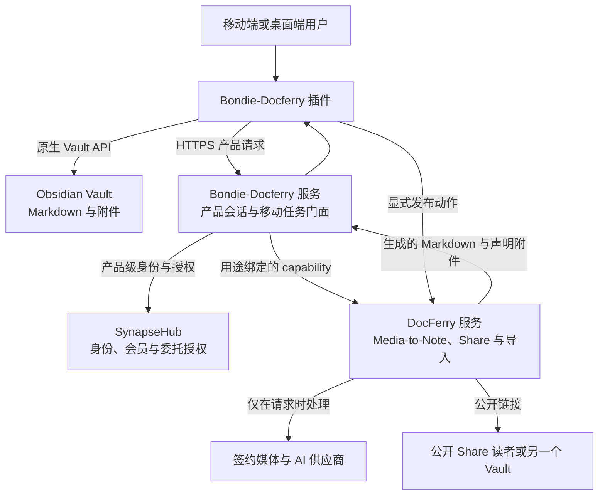
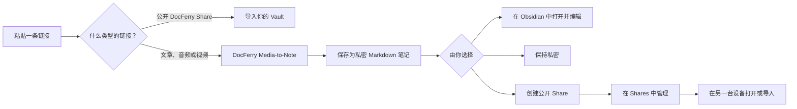

# Bondie-Docferry — 工程文档

> 一个对接托管「媒体转笔记」管线的 Obsidian 插件客户端：一个链接入口进，私密 Markdown 笔记出，可选的公开分享带完整生命周期。

[English](ENGINEERING.md) · **中文** — [‹ 用户文档](README.zh-CN.md)

Bondie-Docferry 是一个移动优先的 Obsidian 插件（TypeScript + esbuild，无前端框架），
作为托管 Bondie / SynapseHub / DocFerry 服务的客户端。客户端负责链接接入、移动端
UI、本地设置、原生 Vault 写入和显式的分享选择；所有需要凭据或重处理的环节都留在
服务端。

## 架构

端到端系统流程：



用户视角的产品流程：



### 归属与信任边界

| 组件 | 拥有 | 不拥有 |
| --- | --- | --- |
| **Obsidian 插件** | 链接接入、移动 UI、本地设置、原生 Vault 写入、显式分享选择 | 供应商凭据、账单数据、远端 Share 真值 |
| **Bondie-Docferry 服务** | 产品会话、移动任务门面、恢复状态、capability 请求 | DocFerry 用户会话、Stripe 卡数据、Vault 内容 |
| **SynapseHub** | 共享身份、账户生命周期、会员投影、产品授权 | 用户笔记、生成的 Markdown、本地 Vault 路径 |
| **DocFerry** | Media-to-Note 处理、共享配额、公开 Share、导入载荷 | Bondie 产品会话、本地 Vault 访问 |
| **Obsidian Vault** | 用户所有的 Markdown 与导入附件 | 托管处理或公开链接 |

安全属性：Bondie-Docferry 与 DocFerry 保持相互独立的产品会话、不共享 cookie；
跨产品调用使用短时效、用途绑定的 capability；AI 与媒体供应商凭据永不离开托管
DocFerry 运行时；插件不会拿到 Auth0 管理 secret、SynapseHub 管理 token、Stripe
secret、供应商 key 或 DocFerry 用户 token。另见
[docs/architecture.md](docs/architecture.md) 与 [PRIVACY.md](PRIVACY.md)。

## 功能是如何实现的

### 链接接入与意图识别

`classifyLinkIntent`（`src/docferry/importContract.ts`）在 Home 输入框的每次输入上
运行，完全不依赖网络：

- **空 / 无效** —— 非 http(s) 或无法解析的 URL 会使 Continue 按钮禁用。
- **`docferry-share`** —— 精确匹配 `https://docferry.bondie.io/s/{slug}`，slug 为
  `[A-Za-z0-9_-]{1,64}`（不允许 query、hash、凭据）。按钮变为 **Import**，无需登录。
- **`web`** —— 其他任何 http(s) URL 以 `{ language, source_url, template }` 提交到
  `POST /v0/parse/jobs`（template 固定为 `default-video-brief`）。Web 链接需要会话；
  按钮变为 **Create note**，未登录时为 **Sign in**。

客户端没有域名白名单；不支持的来源由服务端拒绝，再由 `src/parse/errorPolicy.ts`
映射为 *“此链接暂不支持……”* 的提示。

### Media-to-Note 任务生命周期

`src/parse/parseJob.ts` 驱动远端任务经历
`received → metadata → transcript → structure → template → complete | failed | cancelled`
各阶段（0–100 的 `progress` 值被渲染为友好的状态文案）。轮询从 500 ms 间隔开始
（前 10 次），随后放宽到 1500 ms，以 3 分钟为上限。任务创建携带
`Idempotency-Key`，重试不会重复提交。

传输错误最多容忍 3 次并做指数退避（`src/parse/retryPolicy.ts`，状态显示
*“连接中断。正在重连。”*）。超过次数后，任务被归类为**中断**而非失败：保留
pending 记录，UI 提示 *“重新打开 Bondie-Docferry 继续你的笔记。”* 3 分钟超时而
服务端仍在处理时同样如此。

### 移动端韧性：`pendingParse`

任何 parse 开始前，一条 `pendingParse` 记录（`createdAt`、`jobId`、`language`、
`requestKey`、`sourceUrl`、`template`）会先持久化进插件设置，因此任务可以在应用
切后台或进程被杀后存活。视图打开时 —— 以及 `src/main.ts` 注册的
`visibilitychange` 处理器触发时 —— 视图调用 `resumeFromForeground()` /
`resumePendingParse()` 用现有会话恢复轮询。超过 **24 小时** 的记录由
`normalizePendingParse`（`src/settings.ts`）丢弃。取消会调用远端 cancel 端点；
重试（在 *Account → Processing data* 中对失败/取消任务提供）会重建 pendingParse；
删除会同时清掉远端数据和对应 pending 记录。登出或切换账户总是清除 pending 记录。

### Vault 写入

- **生成笔记**（`src/vault/saveNote.ts`）落入「生成笔记文件夹」（默认
  `Bondie Docferry`），文件名为 `{YYYY-MM-DD} {title}.md`，重名时追加 `-2`…`-999`
  后缀，非法文件名字符会被替换。服务端给的 Markdown **原样写入** —— 客户端不加
  frontmatter；唯一变换是 `removeMatchingLeadingTitle`
  （`src/vault/noteContent.ts`），在与笔记标题一致时去掉开头的 `# 标题`，避免与
  Obsidian 的行内标题重复。
- **导入分享**（`src/vault/importDocferryShare.ts`）落入「导入笔记文件夹」（默认
  `Bondie Docferry/Imports`）。二进制附件通过 Obsidian Vault API 写入其声明的
  `original_path`，或 `attachments/{filename}`。导入总量上限 **50 MB**（移动端安全），
  逐附件校验大小；导入失败会把已创建文件回滚进回收站。`src/vault/vaultPath.ts`
  拒绝绝对路径、反斜杠、`..`/`.`、Windows 设备名、控制字符以及 `<>:"|?*#^[]`。
- **去重**（`src/state/localHistory.ts`）：最多 20 条的本地历史（采集记录最小化为
  scheme+host）使重复链接直接显示 *"Ready / Open note"* 而不会重复保存。可在设置中
  清空且不影响 Vault 文件。

### Share 生命周期

`src/shares/statusPolicy.ts` 把服务端状态映射为标签 —— **Published**、
**Password protected**、**Expired**、**Stopped** —— `lifecyclePolicy.ts` 再按服务端
广播的 capability 决定可用操作：

| 状态 | 复制 / 打开 | 管理（标题、密码、到期） | 停止 | 删除历史 |
| --- | --- | --- | --- | --- |
| `published`、`password_protected` | ✅ | ✅（需 `docferry.share.update`） | ✅（需 `docferry.share.stop`） | — |
| `stopped`、`expired` | — | — | — | ✅（需 `docferry.share.delete`） |

停止是 `DELETE /shares/{id}`（记录保留）；删除历史是 `DELETE /shares/{id}/record`
（不动 Vault 笔记）。发布携带 `Idempotency-Key` 外加一次 400 ms 传输重试
（`src/api/transportRetry.ts`）；分享错误统一提示 *“你的笔记在 Obsidian 中依然安全。”*
（`src/shares/errorPolicy.ts`）。Shares 列表每页 10 条
（`src/shares/pagination.ts`）。

### 登录、权益与用量

登录在系统浏览器打开 `{server}/v0/auth/login`，通过两条相互独立的路径完成
（`src/auth/session.ts`、`src/main.ts`、`src/views/BondieHomeView.ts`）：

1. `obsidian://bondie-docferry-auth` 协议处理器，携带 `code` + `state` 的一次性
   交换（state 做 pending/completed 匹配以阻断重放）；
2. 轮询 `exchangePendingLogin`：先每 2 s（第一分钟），后每 5 s，最长 10 分钟。

得到的不透明产品会话存放在 Obsidian SecretStorage。会员与配额来自
`GET /v0/entitlements/summary`（计划 `docferry_pro`/`free`、月度限额），并在
`docferry.usage.read` capability 允许下读取 `GET /v0/docferry/usage`（渲染为
*“剩余 N 篇媒体笔记 · {日期} 重置”*）。切换账户会先强制登出上一个会话。注意
`defaultLanguage` 每次加载都会被硬重置为 `"source"`、`autoSave` 为 `false`
（`src/main.ts`）。

## 关键模块

| 文件 | 职责 |
| --- | --- |
| `src/main.ts` | 插件生命周期、ribbon/命令注册、登录协议处理器、前台恢复钩子 |
| `src/views/BondieHomeView.ts` | 唯一的 Home 视图：接入表单、预览、Shares 面板、Account 面板、各弹窗 |
| `src/settings.ts` | 设置模型与规范化（文件夹、服务器 URL、pendingParse、本地历史） |
| `src/docferry/importContract.ts` | Share 链接契约与链接意图识别 |
| `src/parse/parseJob.ts` | 远端任务编排、轮询、取消、恢复 |
| `src/parse/{errorPolicy,retryPolicy,pendingParse,result}.ts` | 中断/失败分类、退避、持久化、结果塑形 |
| `src/vault/{saveNote,noteContent,importDocferryShare,vaultPath}.ts` | Vault 写入路径、内容规则、路径安全、导入回滚 |
| `src/shares/{statusPolicy,lifecyclePolicy,pagination,errorPolicy}.ts` | Share 状态、操作门控、分页、友好错误 |
| `src/auth/session.ts` | SecretStorage 会话、登录状态匹配 |
| `src/api/{auth,parse,docferry,entitlements,interconnect,transportRetry}.ts` | 托管服务的 HTTP 层 |
| `src/state/{localHistory,clientInstance}.ts` | 去重索引与稳定客户端标识 |

## 扩展指南

- **新增一种链接类型** —— 在 `src/docferry/importContract.ts` 的
  `classifyLinkIntent` 中扩展并补测试（`tests/link-intent.test.mts`、
  `tests/import-contract.test.mts`），再在 `BondieHomeView` 的采集流程中处理新意图。
- **新增处理模板** —— 创建任务的载荷已携带 `template`（`src/api/parse.ts`）；
  产品当前只发布 `default-video-brief` 一个模板，故刻意未做选择 UI。
- **新增分享操作** —— 在 `src/shares/lifecyclePolicy.ts` 加 capability 检查、
  `statusPolicy.ts` 加标签、`src/api/docferry.ts` 加端点调用。
- **新增友好错误** —— 在对应的 `errorPolicy.ts` 中映射服务端错误码，用户永远
  不该看到原始错误码。

## 开发与构建

```bash
npm ci
npm run verify          # lint + test + build + 产物语法检查 + release 校验
npm audit --audit-level=high
```

验证门会运行 Obsidian ESLint 规则（`eslint-plugin-obsidianmd`）、TypeScript 检查、
单元测试、esbuild 生产构建、`node --check` 语法检查，以及
`scripts/validate-release.mjs`。`main.js` 由 release 自动化构建，有意不提交到源码
分支。每个打标 release 恰好包含 Obsidian 期望的安装产物 —— `main.js`、
`manifest.json`、`styles.css` —— 并附带 GitHub artifact attestation。

设置中的 **Developer mode** 开关解锁 Server URL 覆盖（仅 https，或回环地址上的
http，例如 Android 模拟器的 `10.0.2.2`）和 *Check server* 命令。

## 测试

单元测试跑在 Node 内置 runner 上 —— 不依赖测试框架：

```bash
npm test
```

共 15 个测试套件，覆盖全部纯策略模块：链接意图与导入契约、parse 错误/重试/
pending 行为、share 状态/生命周期/分页/错误策略、vault 路径安全、笔记内容规则、
会话处理、传输重试、本地历史、显示用户回退（`tests/*.test.mts`）。CI 在每次
push 时额外跑完整 `npm run verify` 门与依赖审计。

## 更多文档

[架构与信任边界](docs/architecture.md) · [隐私](PRIVACY.md) ·
[安全](SECURITY.md) · [支持](SUPPORT.md) · [更新日志](CHANGELOG.md) ·
[用户文档](README.zh-CN.md)
