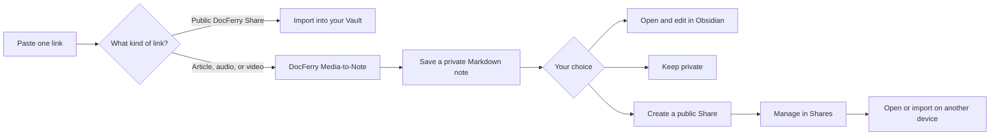

# Bondie-Docferry

**Turn links into notes where they belong: your Vault.**

[](https://github.com/fyaic/Bondie-Docferry-Obsidian-Plugin/releases/latest)
[](https://github.com/fyaic/Bondie-Docferry-Obsidian-Plugin/actions/workflows/ci.yml)
[](manifest.json)
[](LICENSE)

Bondie-Docferry is a mobile-first plugin that turns article, audio, and video links
into native Markdown notes through DocFerry Media-to-Note. The same compact workspace
imports public DocFerry Shares and lets you manage links you have published.

One field handles the whole intake flow. Notes are saved privately first. Reading and
editing stay in Obsidian, and creating a public link is always a separate choice.

## Mobile Experience

<table>
  <tr>
    <td align="center"><br><strong>One place to start</strong><br><sub>Paste a Share, article, audio, or video link.</sub></td>
    <td align="center"><br><strong>Private by default</strong><br><sub>Open the note, share it, or simply keep it private.</sub></td>
  </tr>
  <tr>
    <td align="center"><br><strong>Share without losing control</strong><br><sub>Copy, open, update, stop, or delete Share history.</sub></td>
    <td align="center"><br><strong>Useful account status</strong><br><sub>Identity, membership, and usage without exposing keys.</sub></td>
  </tr>
</table>

These screens were captured from the release candidate running in Obsidian `1.12.7`
on a physical Android phone. Account details, usage values, and Share content were
replaced in the rendering layer before capture; no Vault or service data was changed.

## The Core Flow



## What Makes It Different

| Principle | Product behavior |
| --- | --- |
| **One low-learning entry** | The Home field classifies public Share imports and supported external links for you. |
| **Native ownership** | Generated and imported content is ordinary Markdown in user-selected Vault folders. |
| **Private-first completion** | Processing creates a private note; publishing requires an explicit Share action. |
| **Mobile resilience** | In-progress work survives foreground changes and can be resumed, cancelled, retried, or deleted. |
| **Real Share lifecycle** | Owner Shares are paginated and provide state-appropriate copy, access, stop, and history controls. |
| **Clear product boundaries** | Bondie sign-in, DocFerry processing, and the local Vault remain separate security domains. |

The plugin does not maintain a second content library or scan unrelated Vault files.
See [Architecture and trust boundaries](docs/architecture.md) for the complete product
flow.

## Installation Status

Bondie-Docferry is currently a GitHub release candidate for Obsidian Community review.
It is not yet listed in Obsidian's Community plugins directory.

Reviewers and testers can download `main.js`, `manifest.json`, and `styles.css` from a
matching [GitHub release](https://github.com/fyaic/Bondie-Docferry-Obsidian-Plugin/releases),
place them in a `bondie-docferry` folder inside a test Vault's Community plugins
directory, restart Obsidian, and enable Bondie-Docferry. Normal users should wait for
the Community directory listing rather than install files manually.

## Account And Payment

Public Share import does not require an account or payment. The primary Media-to-Note
workflow requires a Bondie account with DocFerry Pro. Owner Shares, usage, and account
controls also require sign-in.

Bondie-Docferry and DocFerry are separate products with separate sessions. They share
one DocFerry Pro membership for the same hosted capabilities. Bondie-Docferry does not
sell a second subscription. Current pricing, billing terms, and membership management
are shown by the Bondie Account Center and DocFerry checkout surfaces. The correct
Obsidian Community payment label is `Paid` because the primary workflow requires Pro.

See [Support](SUPPORT.md) for subscription management and entitlement recovery.

## Disclosures

- **Payment:** `Paid`. Public Share import is free; Media-to-Note requires DocFerry Pro.
- **Account:** A Bondie account is required for Media-to-Note, owner Shares, usage,
  and account controls. Public Share import works signed out.
- **Network:** Submitted links and authenticated actions use hosted Bondie,
  SynapseHub, and DocFerry services. Account avatars may load from the HTTPS image URL
  supplied by the user's identity provider.
- **Vault access:** The plugin writes only generated/imported notes and declared assets
  to user-selected folders. It does not scan unrelated Vault files.
- **Clipboard:** Clipboard access happens only after explicit Paste or Copy actions.
- **Telemetry and ads:** None in the plugin client.
- **Source availability:** This client is MIT-licensed and public. Hosted service
  source is closed and is not included in this repository.

The plugin stores its opaque product session with Obsidian SecretStorage. It never
receives AI provider keys, Auth0 management credentials, Stripe secrets, or a DocFerry
user session. Read the complete [Privacy notice](PRIVACY.md) and
[Security policy](SECURITY.md).

## Compatibility

- Obsidian `1.11.4` or later
- Android and desktop tested
- `isDesktopOnly: false`
- No Node.js or Electron runtime dependency

## Development

```bash
npm ci
npm run verify
npm audit --audit-level=high
```

The verification gate runs the Obsidian ESLint rules, TypeScript checks, unit tests,
production build, bundle syntax check, and release validation. `main.js` is built by
release automation and is intentionally not committed to the source branch.

Each tagged release contains exactly the install assets expected by Obsidian:
`main.js`, `manifest.json`, and `styles.css`, with GitHub artifact attestations.

## Project Links

- [Latest release](https://github.com/fyaic/Bondie-Docferry-Obsidian-Plugin/releases/latest)
- [Changelog](CHANGELOG.md)
- [Support](SUPPORT.md)
- [Contributing](CONTRIBUTING.md)
- [Privacy](PRIVACY.md)
- [Security](SECURITY.md)

## License

The public plugin client is released under the [MIT License](LICENSE). Hosted service
source is closed and is not part of this repository.
