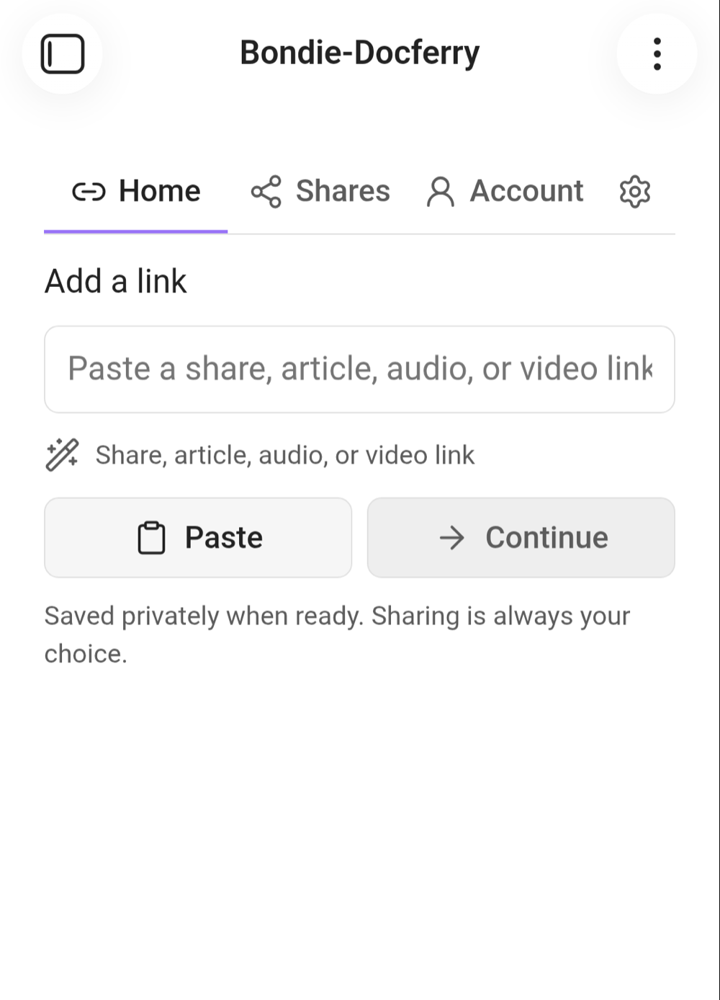
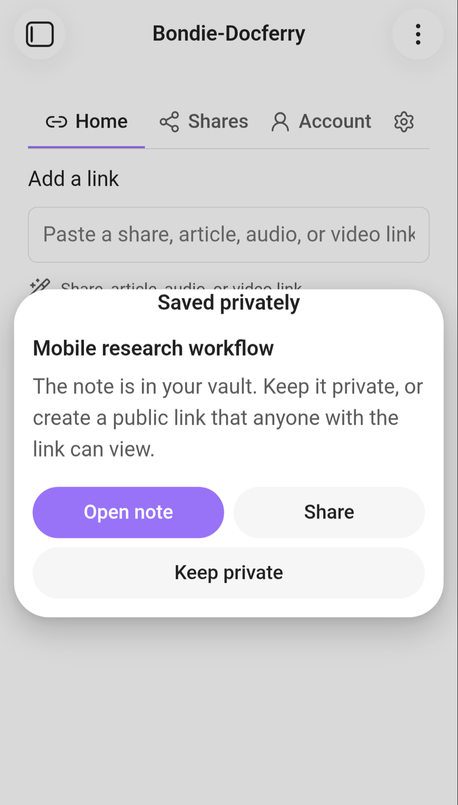
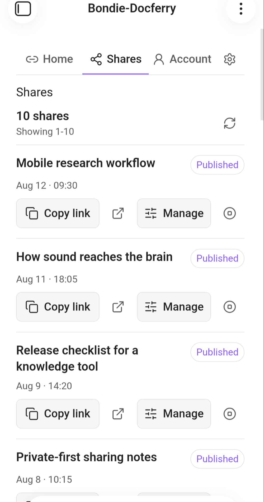
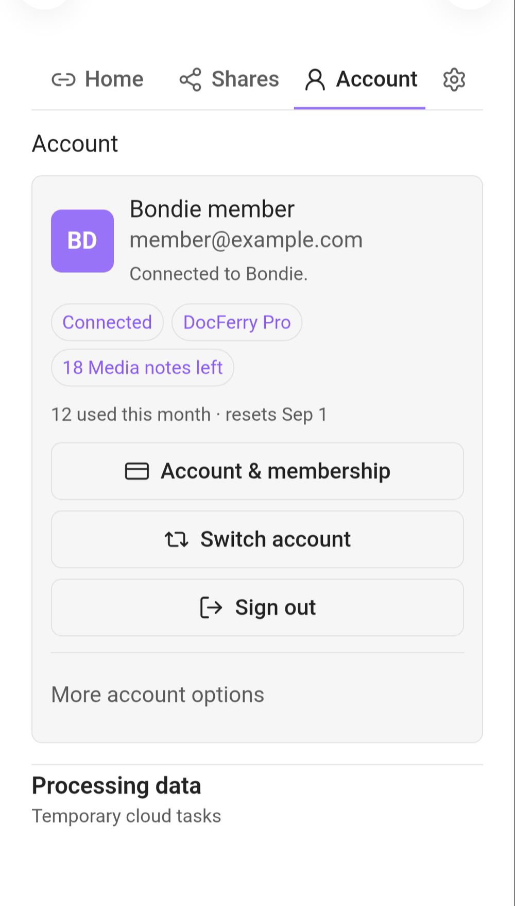

# Bondie-Docferry

> 把文章、音频、视频链接变成笔记 —— 放在它们本该在的地方：你的 Obsidian 仓库（Vault）。

[English](README.md) · **中文** — [工程文档 ›](ENGINEERING.zh-CN.md)

[](https://github.com/fyaic/Bondie-Docferry-Obsidian-Plugin/releases/latest)
[](https://github.com/fyaic/Bondie-Docferry-Obsidian-Plugin/actions/workflows/ci.yml)
[](manifest.json)
[](LICENSE)

你刷到一条值得收藏的东西 —— 一篇文章、一期播客、一个视频。今天的结局往往是：链接烂在聊天记录里，或者躺在一个你再也不会打开的稍后读应用里。

Bondie-Docferry 把这条链接变成你仓库里一篇真正的 Markdown 笔记。粘贴一次，内容就变成你可以阅读、编辑、双向链接、全文搜索的东西 —— 就在你天天用的那个应用里。

## 一个输入框，装下所有链接



**只有一个起点。** 粘贴公开的 DocFerry 链接、文章、音频或视频网址都可以。

- 输入框会告诉你它认出了什么、接下来会发生什么 —— 按钮会变成 **导入（Import）** 或 **创建笔记（Create note）** —— 你确认了才继续。
- 点一下 **Paste** 即可从剪贴板取链接。没有你的操作，任何东西都不会去读你的剪贴板。
- 处理过程中显示大白话进度：*读取链接 → 准备转写 → 整理要点 → 撰写笔记*。

## 从链接，到一篇属于你的笔记

早上粘贴一条视频链接，等你坐下时，仓库里已经有了：

```
Bondie Docferry/
└── 2026-08-14 我如何整理自己的研究.md
```

- **纯 Markdown，别无其他。** 没有专有格式，没有你没同意过的 frontmatter。这篇笔记在 Obsidian、GitHub、任何编辑器里都能用 —— 永远。
- **笔记放哪儿你说了算。** 设置里可以分别指定生成笔记和导入笔记的文件夹（默认：`Bondie Docferry` 和 `Bondie Docferry/Imports`）。
- **保存之前先预览。** 标题、摘要、来源站点、渲染后的内容 —— 想看原始 Markdown 也没问题。
- **保存笔记（Save note）**、**复制笔记（Copy note）**，或直接创建公开链接 —— 都在预览里一步完成。

## 私密优先 —— 分享永远是另一个决定



**默认私密。** 打开笔记、分享它，或者就让它保持私密。

- 每篇完成的笔记都先私密保存。你不主动创建，公开链接就不存在。
- 笔记就绪时由你来选：**打开笔记（Open note）**、**分享（Share）**，或 **保持私密（Keep private）**。
- 分享前会用大白话向你确认：*"任何拿到这个链接的人都能查看这篇笔记。你的仓库和账户信息不会被分享。"*

## 分享出去，控制权还在你手里



**你的链接，你说了算。** 复制、打开、更新、停止或删除分享历史。

- 你创建的每个公开链接都会出现在 **Shares** 页，状态一目了然：*已发布 · 密码保护 · 已过期 · 已停止*。
- **管理（Manage）** 一个链接：改标题、加密码或去掉密码、设置或清除到期时间。
- 随时 **停止（Stop）** 一个链接。笔记留在你的仓库里；链接对所有人立刻失效。
- 事后还能收拾干净：删除已停止/已过期分享的历史记录，完全不碰你的笔记。

## 为真实的手机生活而设计

手机总会打断你 —— 来电、切应用、没电关机。Bondie-Docferry 不会弄丢你的工作。

- **回来时工作还在。** 处理在服务端进行，中途切走应用、甚至 Obsidian 被杀掉，回来时笔记会接着做（保留 24 小时）。
- **可取消、可重试、可删除。** 处理到一半改主意了？取消。网络不好失败了？重试。想清掉临时数据？在 *账户 → 处理数据（Processing data）* 里删除。
- **容忍不稳定网络。** 短暂断线会自动重连，并告诉你正在发生什么，而不是给你一个死掉的转圈。

## 导入别人分享的 DocFerry 笔记

有人通过公开 DocFerry 链接给你发了一篇笔记？不用是作者，也能收藏。

- 粘贴分享链接 —— 它会连同 **附件一起** 导入成一篇笔记，放进你的导入文件夹。
- **免费，无需账户。** 未登录也能导入分享。
- 同一条链接粘两次？它会直接打开已有笔记，不会重复保存。

## 对自己的额度心里有数



**有用的账户状态。** 身份、会员、用量，一目了然，且不暴露密钥。

- 登录 Bondie 账户，随时看到当前登录身份。
- 会员状态说人话：**DocFerry Pro** 或 **Free**。
- 用量是真实数字：*"剩余 5 篇媒体笔记 · 9 月 1 日重置"* —— 不用猜。
- 会员与账户管理都在 Bondie Account Center，一键直达。

> 以上四张截图来自运行在 Android 真机、Obsidian 1.12.7 上的发布候选版。截取前已替换账户信息、用量数值和分享内容。

## 你的笔记始终是你的

- **没有锁定。** 笔记就是你指定文件夹里的普通 Markdown 文件。禁用或卸载插件 —— 笔记还在，照样能读。
- **不扫描你的仓库。** 插件只写入它自己创建或导入的笔记，从不读取、上传仓库里的其他文件。
- **没有遥测，没有广告。** 插件客户端不会上报任何使用数据。
- **会话安全。** 登录凭据存在 Obsidian 自带的 SecretStorage 里。AI 供应商密钥和支付密钥永远不会进入插件。

## 开始使用

1. 需要 Obsidian **1.11.4 或更高版本**，手机端或桌面端均可。
2. **当前状态：发布候选（RC）。** Bondie-Docferry 正在进行社区插件审核，尚未进入官方插件目录。最省事的方式是等目录上架。
3. 测试者和审核者可以手动安装：从 [最新 release](https://github.com/fyaic/Bondie-Docferry-Obsidian-Plugin/releases) 下载 `main.js`、`manifest.json`、`styles.css`，放进 `<vault>/.obsidian/plugins/bondie-docferry/`，重启 Obsidian，在社区插件里启用 Bondie-Docferry。
4. 点击侧边栏的 **船图标**（或运行 **Open home** 命令），粘贴第一条链接，看它变成笔记。

导入分享开箱即用、无需账户。把文章、音频、视频变成笔记需要免费 Bondie 账户和 DocFerry Pro 会员 —— 见下文。

## 需要知道的事

**定价。** 导入公开 DocFerry 分享免费、无需账户。媒体转笔记（链接 → 笔记）、你创建的分享、用量查看，需要 Bondie 账户和 DocFerry Pro 会员。一个会员同时覆盖 Bondie-Docferry 和 DocFerry —— 插件绝不卖第二份订阅。当前价格与账单条款以 Bondie Account Center 和 DocFerry 收银台页面为准。

**披露**（Obsidian 社区插件要求）：

- **付费：** `Paid`。分享导入免费；媒体转笔记需要 DocFerry Pro。
- **账户：** 媒体转笔记、分享管理、用量和账户控制需要登录；公开分享导入无需登录。
- **网络：** 提交的链接和登录后的操作使用 Bondie、SynapseHub、DocFerry 托管服务。账户头像和经过校验的来源缩略图通过 HTTPS 从其图片宿主加载。
- **仓库访问：** 插件只向你选择的文件夹写入生成/导入的笔记及声明的附件，不扫描无关文件。
- **剪贴板：** 仅在你明确点击 **Paste** 或 **Copy** 时访问。
- **遥测与广告：** 插件客户端内没有。
- **源码可得性：** 本客户端 MIT 开源；托管服务源码闭源，不在本仓库内。

完整细节：[隐私声明](PRIVACY.md) · [安全策略](SECURITY.md) · [支持与订阅](SUPPORT.md)。

**兼容性。** Obsidian 1.11.4+ · 已在 Android 和桌面端测试 · 不依赖 Node.js 或 Electron。

## 项目链接

[最新 release](https://github.com/fyaic/Bondie-Docferry-Obsidian-Plugin/releases/latest) ·
[更新日志](CHANGELOG.md) · [支持](SUPPORT.md) · [贡献](CONTRIBUTING.md) ·
[隐私](PRIVACY.md) · [安全](SECURITY.md) · [工程文档](ENGINEERING.zh-CN.md)

## 许可证

公开的插件客户端以 [MIT License](LICENSE) 发布。托管服务源码闭源，不属于本仓库。
