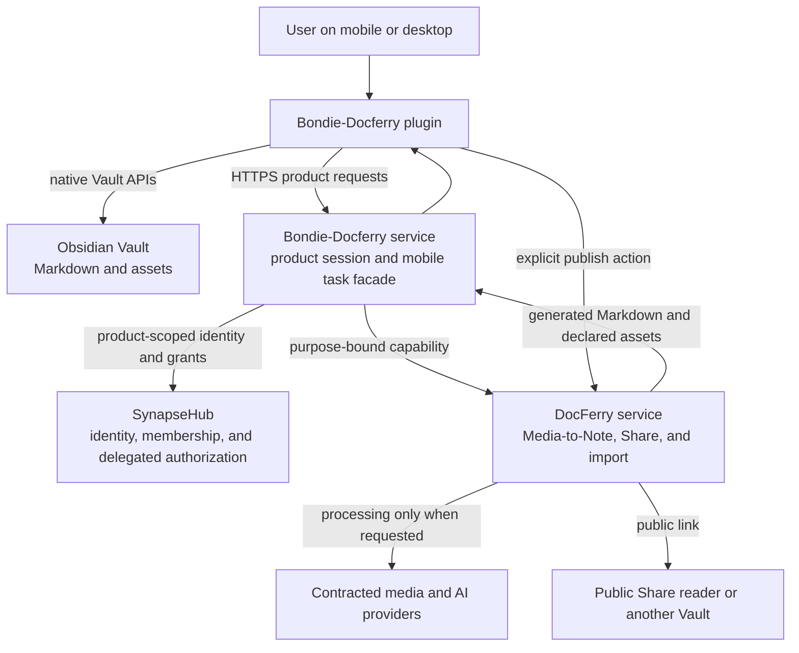

# Architecture And Trust Boundaries

Bondie-Docferry is a public Obsidian client for a hosted, multi-product workflow. The
products cooperate through explicit contracts while retaining separate sessions and
ownership boundaries.

## System Flow

## Ownership

| Component | Owns | Does not own |
| --- | --- | --- |
| **Obsidian plugin** | Link intake, mobile UI, local settings, native Vault writes, explicit sharing choice | Provider credentials, billing data, remote Share truth |
| **Bondie-Docferry service** | Product session, mobile task facade, recovery state, capability requests | DocFerry user session, Stripe card data, Vault contents |
| **SynapseHub** | Shared identity, account lifecycle, membership projection, product authorization | User notes, generated Markdown, local Vault paths |
| **DocFerry** | Media-to-Note processing, shared quota, public Shares, import payloads | Bondie product session, local Vault access |
| **Obsidian Vault** | User-owned Markdown and imported assets | Hosted processing or public links |

## Security Properties

- Bondie-Docferry and DocFerry use separate product sessions and do not share cookies.
- Cross-product calls use short-lived, purpose-bound capabilities.
- AI and media provider credentials stay in the hosted DocFerry runtime.
- The plugin receives no Auth0 management secret, SynapseHub management token, Stripe
  secret, provider key, or DocFerry user token.
- Generated notes are saved privately before any public link exists.
- The plugin does not enumerate or upload unrelated Vault files.
- Public Share import is origin-restricted and writes through Obsidian Vault APIs.

For user-facing data handling and retention details, read [Privacy](../PRIVACY.md).
